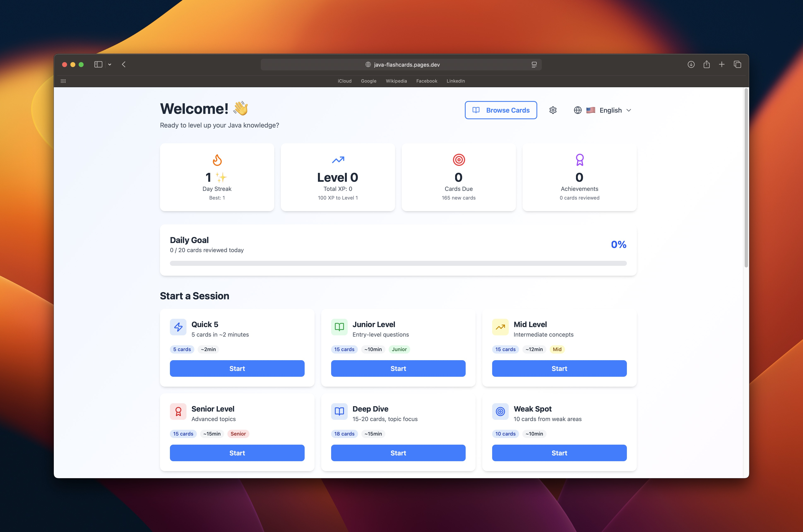

# JavaMaster - Interview Flashcards System

A web application designed to help developers prepare for Java technical interviews through an adaptive, engagement-driven flashcard system.



## Overview

**JavaMaster** is a bilingual flashcard app featuring spaced repetition, gamification, and comprehensive Java interview content. Study smarter with adaptive algorithms that optimize your learning schedule.

**Key Highlights:**
- 🧠 SM-2 spaced repetition algorithm
- 🌍 Full English/Turkish support
- 🎮 XP, levels, streaks, and achievements
- 📊 Topic mastery and progress tracking
- ⚡ 8 session types for different study needs
- 💾 Local-first with IndexedDB storage
- 📱 PWA support - install and use offline

### Topics Covered
Java Basics • OOP • Collections • Concurrency • JVM Internals • Streams API • Exception Handling • Design Patterns • Spring Framework • Testing

## Project status and licensing

- **Status:** Functional portfolio and learning project, deployed on Cloudflare Pages at [java-flashcards.pages.dev](https://java-flashcards.pages.dev/). It is maintained on a best-effort basis without a service-level or support commitment.
- **License:** This repository currently has no license file. GitHub may permit viewing and forking through its platform terms, but no broader permission is granted to copy, modify, or redistribute the source code or bundled flashcard and translation content.
- **Content provenance:** The repository history records a single project author, but the flashcards are described as drawing on common Java interview resources and individual source provenance is not documented. Dependencies remain subject to their own licenses, and the learning model is based on the SuperMemo SM-2 method.

## Tech Stack

- **Frontend**: React 19, Vite 7
- **Styling**: Tailwind CSS 4 (build-time processing via @tailwindcss/vite)
- **Internationalization**: react-i18next with 7 namespaces
- **State Management**: Zustand with persistence
- **Storage**: IndexedDB via Dexie.js
- **Animations**: Framer Motion
- **Icons**: Lucide React
- **Code Highlighting**: Prism.js
- **Routing**: React Router
- **Utilities**: date-fns

## Getting Started

### Prerequisites
- Node.js 18+
- npm or yarn

### Installation

1. Clone the repository
```bash
git clone <repository-url>
cd interview-flashcards
```

2. Install dependencies
```bash
npm install
```

3. Start the development server
```bash
npm run dev
```

4. Open your browser and navigate to `http://localhost:5173`

### Build for Production

```bash
npm run build
npm run preview
```

## Project Structure

```
src/
├── components/
│   ├── flashcard/
│   │   ├── FlashcardView.jsx       # Main flashcard component with flip animation
│   │   └── ConfidenceButtons.jsx   # 4-level confidence rating buttons
│   ├── ui/
│   │   ├── Button.jsx               # Reusable button component
│   │   ├── Card.jsx                 # Card container component
│   │   ├── Badge.jsx                # Badge/tag component
│   │   └── Progress.jsx             # Progress bar component
│   ├── SpacedRepetitionInsights.jsx # Spaced repetition dashboard widget
│   └── LanguageSwitcher.jsx         # Language toggle component
├── pages/
│   ├── Dashboard.jsx                # Main dashboard with stats and session selector
│   ├── StudySession.jsx             # Active study session page
│   ├── FlashcardBrowser.jsx         # Browse all cards by topic
│   └── Settings.jsx                 # Settings and data management
├── store/
│   ├── useFlashcardStore.js         # Flashcard state management
│   └── useProgressStore.js          # User progress and achievements
├── services/
│   ├── storage.js                   # IndexedDB operations via Dexie
│   └── spacedRepetition.js          # SM-2 algorithm implementation
├── data/
│   ├── flashcardsData.js            # Flashcard content data
│   └── initializeData.js            # Initialize flashcards in IndexedDB
├── i18n/
│   └── config.js                    # i18next configuration
├── utils/
│   ├── constants.js                 # App constants (no UI strings, config only)
│   ├── helpers.js                   # Helper functions
│   └── cardLocalization.js          # Card content localization utility
└── types/
    └── index.ts                     # TypeScript type definitions

public/locales/                      # Translation files (238 UI strings)
├── en/
│   ├── common.json                  # Common UI strings
│   ├── dashboard.json               # Dashboard translations
│   ├── session.json                 # Study session translations
│   ├── achievements.json            # Achievement translations
│   ├── topics.json                  # Topic name translations
│   ├── browser.json                 # Flashcard browser translations
│   └── settings.json                # Settings page translations
└── tr/                              # Turkish translations (mirrors en/)
```

## How to Use

### Starting a Study Session

1. **Choose a Session Type**: From the dashboard, select one of the available session types
2. **Review Cards**: Cards will be shown one at a time
3. **Flip the Card**: Click the card or press Space to reveal the answer
4. **Rate Your Confidence**: Select one of 4 confidence levels:
   - 😰 No Idea (review in 10 minutes)
   - 🤔 Partial (review in 1 day)
   - ✅ Got It (review in 3 days)
   - 🔥 Mastered (review in 7+ days)

### Keyboard Shortcuts

- `Space`: Flip card
- `1-4`: Select confidence level (when answer is visible)
- Click anywhere on card to flip

### Building Your Streak

- Study at least one session per day to maintain your streak
- Streaks unlock achievements and XP multipliers
- Use streak save feature (once per week) to prevent streak breaks

## Internationalization (i18n)

This project uses **react-i18next** for full bilingual support. All UI strings and flashcard content are available in English and Turkish.

### Translation Structure
- **UI Strings**: Organized in 7 namespaces under `public/locales/{en,tr}/`
- **Card Content**: Embedded translations in `flashcardsData.js` using `translations` field
- **Documentation**: See [docs/i18n-standards.md](docs/i18n-standards.md) for complete guidelines

### Adding Translations

For UI strings, add to the appropriate namespace in `public/locales/`:
```json
// public/locales/en/common.json
{
  "labels": {
    "myNewLabel": "My New Label"
  }
}
```

### Naming Conventions
- **Topics**: snake_case (e.g., `exception_handling`)
- **Sessions**: camelCase (e.g., `juniorLevel`)
- **Achievements**: kebab-case (e.g., `first-steps`)
- **Confidence**: lowercase (e.g., `unknown`, `mastered`)

## Customization

### Adding More Flashcards

Add flashcards to the `flashcardsData` array in `src/data/flashcardsData.js`:

```javascript
{
  id: 'custom-001',
  question: 'Your question here',
  answer: 'Your answer here',
  explanation: 'Additional context',
  translations: {
    tr: {
      question: 'Turkish question',
      answer: 'Turkish answer',
      explanation: 'Turkish explanation'
    }
  },
  codeExample: {
    code: 'your code here',
    language: 'java'
  },
  topic: 'oop',
  difficulty: 'mid',
  tags: ['tag1', 'tag2'],
  realWorldUse: 'Real-world application description'
}
```

**Note**: Make sure the topic exists in `TOPIC_INFO` in `src/utils/constants.js` and has translations in `public/locales/{en,tr}/topics.json`.

### Adjusting Session Types

Modify session configurations in `src/utils/constants.js`:

```javascript
export const SESSION_CONFIGS = {
  quick5: {
    cardCount: 5,
    estimatedTime: 2,
    icon: 'Zap'
  }
  // Note: name and description come from i18n (session:{key}.name)
}
```

## Current Features

### Study System ✅
- [x] Basic flashcard system with flip animation
- [x] Spaced repetition algorithm (SM-2)
- [x] 8 session types (Quick 5, Junior/Mid/Senior Level, Deep Dive, Weak Spot, Interview, Random)
- [x] 4-level confidence rating system
- [x] Code syntax highlighting

### Progress & Gamification ✅
- [x] Progress tracking with IndexedDB
- [x] Streak system with daily tracking
- [x] XP and leveling system
- [x] Achievement system (15 achievements across 5 categories)
- [x] Achievements display page with progress tracking
- [x] Topic mastery tracking
- [x] Dashboard with statistics

### User Experience ✅
- [x] Flashcard browser (browse by topic)
- [x] Settings page (export/import/delete data)
- [x] Spaced repetition insights widget
- [x] Full bilingual support (English/Turkish)
- [x] Language switcher
- [x] Keyboard shortcuts
- [x] PWA support - installable, works offline

## Contributing

Contributions are welcome! Please feel free to submit a Pull Request.

## Acknowledgments

- Spaced repetition algorithm based on SuperMemo SM-2
- Questions sourced from common Java interview resources
- Built with modern web technologies

---

**Happy studying! 🎓**
